# Brownfield Workflow Path

This document describes the brownfield pre-phase, how it diverges from the greenfield path, and how the provisional `forensic-br.json` it produces is consumed by Phase 1.

---

## Project Type Detection

The orchestrator determines project type at intake based on the inputs provided:

| Condition | Project Type | Starting Point |
|---|---|---|
| No existing repositories provided | **Greenfield** | Phase 1 directly |
| One or more existing repositories provided | **Brownfield** | Pre-phase first, then Phase 1 |
| New component added to an existing system | **Hybrid** | Brownfield pre-phase for existing components; greenfield treatment for the new component |

**Rule:** If `forensic-br.json` does not exist and the project provides existing repos, the orchestrator MUST run the forensic-analyst pre-phase before advancing to Phase 1.

---

## Brownfield vs Greenfield Path Diagram

```mermaid
flowchart TD
    intake([intake])

    intake -->|"Greenfield\n(no existing repos)"| phase1_direct["→ Phase 1 directly"]

    intake -->|"Brownfield\n(existing repos provided)"| prephase

    subgraph prephase["Pre-Phase — forensic-analyst archetype\n(.github/skills/uwf-forensic-analyst/SKILL.md)"]
        direction TB
        ra["1. repo-audit\nEnumerate repos, map boundaries, catalog tech stack"]
        ah["2. artifact-harvest\nCollect commits, docs, configs, CI/CD, tests, ADRs"]
        ii["3. intent-inference\nInfer requirements + decisions; assign preliminary confidence"]
        cs["4. confidence-score\nFinalize confidence tiers; write forensic-br.json"]
        gr["5. gap-report\nSurface all gap entries; block until resolved"]
        review(["human review\nResolve or accept-out-of-scope each gap"])

        ra --> ah --> ii --> cs --> gr --> review
    end

    review --> fbr

    fbr[("forensic-br.json\n(provisional uwf-br)\nentries: confirmed / inferred-strong\n/ inferred-weak / gap")]

    fbr --> phase1

    phase1_direct --> phase1

    subgraph phase1["Phase 1 — Foundation (shared)\nReads forensic-br.json if present"]
        direction TB
        disc["discovery\nValidates confirmed/inferred-strong;\nflags inferred-weak for re-examination"]
        req["requirements\nPromotes confirmed+inferred-strong;\nchallenges inferred-weak;\nblocks gap stories"]
        adr["adr\nCreates formal ADRs from confirmed decisions;\ndraft ADRs for inferred; skips gap decisions"]
        rp["risk-planner\nAdds inferred-weak + gap entries as scope uncertainty risks"]
        sp["security-planner\nValidates inferred security constraints"]
        tp["test-planner\nUses observed test types from forensic-br.json as baseline"]
        bp["blueprint\nMerges forensic-br.json strata into uwf-br;\npreserves confidence + evidence fields"]

        disc --> req --> adr --> rp --> sp --> tp --> bp
    end

    phase1 --> phase2

    subgraph phase2["Phase 2 — Execution (archetype-specific)"]
        pm["Project Manager\n(uwf-project_manager)"]
        swe["Software Developer\n(uwf-sw_dev)"]
    end

    phase2 --> phase3

    subgraph phase3["Phase 3 — Closure (shared)"]
        tracking["project-tracking"]
        ref["refinement *\nConfidence promotion gate on brownfield"]
        acc["acceptance"]
        snap["snapshot\nIncludes confidence scores in uwf-drs"]
        retro["retro"]

        tracking --> ref --> acc --> snap --> retro
    end

    note1["* refinement role differs:\nBrownfield: inferred-weak must be promoted or blocked;\n  gap stories cannot pass — must be resolved or closed.\nGreenfield: standard field completeness + quality controls only."]
    note1 -.-> ref
```

---

## Pre-Phase Stage Details

The pre-phase is governed by the `uwf-forensic-analyst` archetype skill (`.github/skills/uwf-forensic-analyst/SKILL.md`). All five stages run sequentially; each stage is gated before the next begins.

| # | Stage | Agent | Key Output |
|---|---|---|---|
| 1 | **repo-audit** | `uwf-forensic-analyst-repo-audit` | `forensic-repo-audit.md` — repo inventory, boundaries, seams, tech stack |
| 2 | **artifact-harvest** | `uwf-forensic-analyst-artifact-harvest` | `forensic-artifact-harvest.md` — commits, docs, configs, CI/CD, tests, ADRs |
| 3 | **intent-inference** | `uwf-forensic-analyst-intent-inference` | `forensic-intent.md` — inferred requirements, decisions, constraints with preliminary confidence |
| 4 | **confidence-score** | `uwf-forensic-analyst-confidence-score` | `forensic-br.json` — provisional Build Record with finalized confidence tiers |
| 5 | **gap-report** | `uwf-forensic-analyst-gap-report` | `forensic-gap-report.md` — structured human-review document; sets `gap_report_reviewed: true` on completion |

**Hard gate:** The pre-phase cannot exit until `forensic-br.json` field `gap_report_reviewed` is `true`. Every `gap` entry must have a human-provided resolution or an explicit "Accepted as out-of-scope" mark.

---

## Pre-Phase → Phase 1 Handoff

When the pre-phase completes, `forensic-br.json` contains a provisional Build Record where every entry carries a `confidence` field. Phase 1 uses this record as its starting state.

### Confidence Tiers

| Tier | Meaning | Phase 1 Treatment |
|---|---|---|
| `confirmed` | Explicitly documented and human-verified | Accepted as-is; Phase 1 creates formal artifacts from it |
| `inferred-strong` | Multiple independent artifacts agree | Accepted with validation; Phase 1 confirms or escalates |
| `inferred-weak` | Single artifact or ambiguous evidence | Phase 1 must challenge and promote or flag for resolution |
| `gap` | No evidence found; human resolution required | Phase 1 cannot proceed with this entry until it is resolved |

### Per-Stage Handoff Contract

| Phase 1 Stage | Input from `forensic-br.json` | Action |
|---|---|---|
| **Intake** | `gap_report_reviewed: true` (pre-condition) | Validates the pre-phase is complete. Reads project-scope (stratum 0) and constraints (stratum 3). |
| **Discovery** | All strata | Treats `confirmed` + `inferred-strong` as verified prior work. Flags `inferred-weak` for re-examination. Treats `gap` entries as known unknowns to investigate. |
| **Requirements** | Stratum 1 (requirements) | Promotes `confirmed` + `inferred-strong` to `refined` status. Challenges `inferred-weak`. Blocks `gap` stories. |
| **ADR** | Stratum 2 (decisions) | Creates formal ADRs from `confirmed` decisions. Creates draft ADRs for `inferred-strong` / `inferred-weak` with `Confidence:` annotation. Skips `gap` decisions — flags as unresolved. |
| **Risk Planner** | Strata 1–3 | Adds `inferred-weak` + `gap` entries as scope-uncertainty risk inputs. |
| **Security Planner** | Stratum 3 (constraints) | Validates all inferred security constraints. Confirms or supersedes before security plan closes. |
| **Test Planner** | Stratum 4 (test-scope) | Uses observed test types as the coverage baseline floor. |
| **Blueprint** | All strata | Merges into `uwf-br`; carries `confidence` and `evidence` fields through to preserve the full audit trail in `uwf-drs`. |

---

## Phase 3 Refinement — Confidence Promotion Gate

On brownfield projects, Refinement acts as the **confidence promotion gate** in addition to its standard field-completeness and quality-control checks.

| Story Confidence at Refinement Entry | Required Action | Pass / Block |
|---|---|---|
| `confirmed` | Standard field-completeness + quality-control checks only | Passes if checks pass |
| `inferred-strong` | Standard checks; `confidence_basis` field must be populated | Passes if checks pass |
| `inferred-weak` | Human must promote to `confirmed` (with traceable source) or `inferred-strong` (with second independent artifact) | **Blocked** unless promoted |
| `gap` | Must be resolved (promoted with evidence) or closed (removed from scope) | **Blocked** until resolved or closed |

The Refinement Report (`{role}-refinement-report.md`) includes:
- **Brownfield Gap Resolution Table** — every `inferred-weak` and `gap` story with the action taken.
- **Brownfield Promotion Log** — every story promoted from a lower tier, with the evidence cited.

Stories that remain `inferred-weak` or `gap` after the Refinement pass are set to `blocked` status and cannot proceed to Acceptance.

---

## Artifacts Produced by the Brownfield Path

| Artifact | Stage | Path | Purpose |
|---|---|---|---|
| `forensic-repo-audit.md` | repo-audit | `tmp/workflow-artifacts/forensic-repo-audit.md` | Repo inventory and tech stack map |
| `forensic-artifact-harvest.md` | artifact-harvest | `tmp/workflow-artifacts/forensic-artifact-harvest.md` | Evidence catalog |
| `forensic-intent.md` | intent-inference | `tmp/workflow-artifacts/forensic-intent.md` | Inferred requirements, decisions, constraints |
| `forensic-br.json` | confidence-score | `tmp/workflow-artifacts/forensic-br.json` | Provisional Build Record with confidence tiers |
| `forensic-gap-report.md` | gap-report | `tmp/workflow-artifacts/forensic-gap-report.md` | Human-review gap document |

All brownfield artifacts use the `forensic-` prefix and are stored in `tmp/workflow-artifacts/`.

---

## References

- Forensic analyst archetype skill: `.github/skills/uwf-forensic-analyst/SKILL.md`
- Stage gate definitions: `.github/skills/uwf-forensic-analyst/stages.yaml`
- Gate enforcement script: `.github/skills/uwf-forensic-analyst/run.mjs`
- Refinement confidence promotion: `.github/skills/uwf-refinement/SKILL.md`
- Architecture spec: `docs/uwf-architecture.md`
