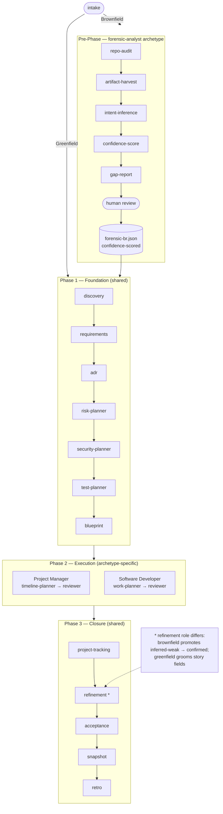

# Universal Agentic Workflow (UWF) — Architecture Spec

## Concept

UWF is an orchestrated multi-stage workflow framework for AI-assisted project delivery. It operates in two modes:

1. **Agent-orchestrated** — A root orchestrator agent delegates to subagents (custom agents), each scoped to a workflow stage.
2. **Human-orchestrated** — The user drives sequencing manually via semi-guided prompt files, invoking stages on demand.

The orchestrator is not a fixed persona. It assumes **archetypes** (implemented as skills) that define its domain lens — e.g., Project Manager or Software Developer. Archetypes shape which stages activate and how the orchestrator reasons about work, without hardcoding behavior.

---

## Mapping to GitHub Copilot Customization Primitives

| UWF Concept | Copilot Primitive | Location | Rationale |
|---|---|---|---|
| Orchestrator behavior | `copilot-instructions.md` | `.github/copilot-instructions.md` | Always-on project context and orchestration rules |
| Archetypes (PM, SWE, SA, Forensic) | **Skills** (`.github/skills/uwf-{name}/SKILL.md`) | `.github/skills/uwf-project_manager/`, `.github/skills/uwf-sw_dev/`, `.github/skills/uwf-solutions_architect/`, `.github/skills/uwf-forensic-analyst/` | Loaded at orchestrator startup for the requested persona. Each archetype bundles `SKILL.md` (agent-readable spec), `stages.yaml` (authoritative stage/gate definitions), and `run.mjs` (gate-check and stage-list CLI script). |
| Workflow stages | **Custom Agents** (`.github/agents/uwf-{role}-{job}.agent.md`) | `.github/agents/` | Each stage is an isolated agent profile with scoped tools and prompt. Subagent isolation keeps context windows clean. |
| Entry-point prompts | **Prompt Files** (`.github/prompts/*.prompt.md`) | `.github/prompts/` | Human-facing triggers that start a workflow run by invoking the orchestrator with a persona argument. |
| Always-on coding standards | **Instructions** (`.github/instructions/*.instructions.md`) | `.github/instructions/` | File-pattern-scoped rules applied automatically across the workspace. |

---

## Workflow Stages

### Project Type: Greenfield vs Brownfield

UWF supports two project types:

- **Greenfield** — New project with no prior codebase. Workflow begins at Phase 1 directly.
- **Brownfield** — Existing project (one or more repos) where intent was never formally recorded. Workflow begins at the Brownfield Pre-Phase, which runs before Phase 1 and produces a provisional Build Record (`uwf-br`) with confidence scores. Phase 1 then validates and hardens that baseline.

```
intake
  ├── Greenfield ──────────────────────────────────────────────────────┐
  │                                                                     ↓
  └── Brownfield → Pre-Phase (forensic) → Provisional uwf-br → Phase 1 (shared)
                     repo-audit                                         │
                     artifact-harvest                                   ↓
                     intent-inference                          Phase 2 (archetype)
                     confidence-score                                   │
                     gap-report → human review                          ↓
                                                               Phase 3 (shared)
```



### Brownfield Pre-Phase — Forensic Analysis

Runs **before Phase 1** on brownfield projects only. Governed by the `uwf-forensic-analyst` skill (`.github/skills/uwf-forensic-analyst/SKILL.md`).

The fundamental challenge for brownfield projects is that intent was never recorded. Code exists, commits exist, tests exist — but the *why* behind decisions, the original requirements, the rejected alternatives, and the business rationale are missing. The pre-phase uses forensic analysis: observing what exists and inferring what was intended.

| Stage | Agent Profile | Purpose |
|---|---|---|
| **Repo Audit** | `uwf-forensic-analyst-repo-audit.agent.md` | Enumerate all repos in scope, map service boundaries and seams, catalog tech stack per repo. |
| **Artifact Harvest** | `uwf-forensic-analyst-artifact-harvest.agent.md` | Collect all available evidence: commits, tickets, docs, configs, CI/CD definitions, test suites, existing ADRs. |
| **Intent Inference** | `uwf-forensic-analyst-intent-inference.agent.md` | Infer requirements and decisions from observed behavior and artifacts. Assign preliminary confidence to each entry. |
| **Confidence Score** | `uwf-forensic-analyst-confidence-score.agent.md` | Formal scoring pass: assign tier (`confirmed`, `inferred-strong`, `inferred-weak`, `gap`) to every entry. Write provisional `forensic-br.json`. |
| **Gap Report** | `uwf-forensic-analyst-gap-report.agent.md` | Surface all `gap` entries; produce the human-review document; block until every gap is resolved or accepted as out-of-scope. |

**Output:** `forensic-br.json` — a provisional Build Record where every entry carries a confidence score. Handed to Phase 1 as its starting state.

**Exit gate:** The pre-phase is complete only when `gap_report_reviewed: true` is set in `forensic-br.json`. This requires every `gap` entry to have a human-provided resolution or an explicit out-of-scope acceptance.

### Phase 1 — Foundation (shared across all archetypes)

Every workflow begins here. For greenfield projects, Phase 1 starts from scratch. For brownfield projects, Phase 1 reads `forensic-br.json` as its starting state and validates or replaces provisional entries. The goal is situational awareness and constraint capture.

| Stage | Agent | Purpose |
|---|---|---|
| **Intake** | Persona-specific intake agent (e.g. `uwf-sw_dev-intake`, `uwf-project_manager-intake`, `uwf-solutions_architect-design-planner`) | Parse the request. Classify scope. Identify actors, constraints, and initial domain terms. |
| **Discovery** | `uwf-core-discovery` | Audit the existing codebase/project state. Enumerate what exists, what's missing, and what's stale. |
| **Requirements** | `uwf-core-requirements` | Elicit and structure functional + non-functional requirements. Output structured user stories. |
| **ADR** | `uwf-core-adr` | *(Conditional)* Capture architectural decisions using the `uwf-adr` skill. Conditional on requirements flagging `ADR:` items. |
| **Risk Planner** | `uwf-core-risk-planner` | Identify and document project-level execution risks: schedule, dependency, technical-debt, and external. Produce a risk register. Appends to `uwf-br` layer 1; flags blocking dependency risks in layer 2. |
| **Security Planner** | `uwf-core-security-plan` | *(Conditional)* Threat model the proposed scope. Conditional on requirements flagging security-sensitive items. |
| **Test Planner** | `uwf-core-test-planner` | Define the test strategy: unit/integration/E2E ratio, coverage targets, critical path tests. |
| **Blueprint** | `uwf-core-blueprint` | Synthesize all Phase 1 outputs into the Canonical Build Spec (`uwf-cbs`) SQLite database and initialize the Build Record (`uwf-br`) strata 0–4. Produces the machine-readable handoff artifact from Phase 1 to Phase 2. |

#### Phase 1 Brownfield Behavior — Per-Stage

When `forensic-br.json` is present (brownfield mode), each Phase 1 stage applies the following additional behavior:

| Stage | Brownfield Behavior |
|---|---|
| **Intake** | Reads `forensic-br.json` strata 0 (project-scope) and 3 (constraints). Validates the pre-phase is complete (`gap_report_reviewed: true`). Passes the provisional Build Record path to all downstream stages. |
| **Discovery** | Reads all `confirmed` and `inferred-strong` entries as verified prior work — does not re-derive them. Flags all `inferred-weak` entries for re-examination. Treats `gap` entries as known unknowns to investigate. Appends new findings rather than overwriting the provisional baseline. |
| **Requirements** | Converts `confirmed` and `inferred-strong` entries from `forensic-br.json` stratum 1 (requirements) into high-confidence **draft** stories, preserving their `confidence` and `confidence_basis` (or equivalent) so `uwf-refinement` can later promote them to `refined` after quality checks. Challenges every `inferred-weak` entry: if Phase 1 evidence confirms it, upgrade its confidence; if not, flag for human resolution while keeping `status: draft`. Does not generate stories for `gap` entries — those remain blocked until promoted. |
| **ADR** | Reads existing architectural decisions from `forensic-br.json` stratum 2 (decisions). For each `confirmed` decision, creates a formal ADR and marks it `Supersedes: forensic-inference`. For each `inferred-strong` or `inferred-weak` decision, creates a draft ADR with a `Confidence:` field noting the original tier and evidence. Does not create ADRs for `gap` decisions — flags them as unresolved architectural unknowns. |
| **Risk Planner** | Adds `inferred-weak` requirements and unresolved `gap` entries as additional risk inputs — each represents scope uncertainty that may affect schedule and dependency planning. |
| **Security Planner** | Reads inferred security constraints from `forensic-br.json` stratum 3 (constraints). Validates that inferred constraints are confirmed or explicitly superseded before the security plan closes. |
| **Test Planner** | Reads observed test types from the artifact harvest (stratum 4 of `forensic-br.json`) and uses them as the baseline test coverage floor. Strategy must cover all test types already present in the codebase and extend them as needed. |
| **Blueprint** | Merges `forensic-br.json` strata into the `uwf-br` Build Record. Maps `forensic-br.json` confidence tiers into the `uwf-br` `confidence` field and folds each entry’s evidence into the corresponding `uwf-br` source/content records so downstream stages and the `uwf-drs` snapshot preserve the full audit trail. |

### Phase 2 — Execution (archetype-specific, pick one)

#### Archetype: Project Manager

| Stage | Agent | Skill (persona) | Purpose |
|---|---|---|---|
| **Intake (PM)** | `uwf-project_manager-intake` | — | Refine scope into milestones, epics, and delivery phases. Stakeholder mapping. |
| **Timeline Planner** | `uwf-project_manager-timeline-planner` | — | Sequence milestones. Identify critical path, parallel workstreams, and dependency chains. Produce sprint/roadmap artifact and issues backlog. |
| **Reviewer** | `uwf-project_manager-reviewer` | `uwf-reviewer` (`Persona: pm`) | Validate plan completeness: timeline feasibility, stakeholder coverage, risk alignment, scope integrity, and blockers. |

#### Archetype: Software Developer

| Stage | Agent | Skill (persona) | Purpose |
|---|---|---|---|
| **Intake (SWE)** | `uwf-sw_dev-intake` | — | Scope the active issue: goal, acceptance criteria, constraints, and explicit out-of-scope boundaries. |
| **Work Planner** | `uwf-sw_dev-work-planner` | — | Sequence implementation tasks. Identify build order, test-first candidates, and integration points. |
| **Implementer** | `uwf-issue-implementer` | — | Execute code and infrastructure changes strictly against the approved plan and ADRs. |
| **Reviewer** | `uwf-sw_dev-reviewer` | `uwf-reviewer` (`Persona: dev`) | Implementation review gate: correctness, dependency ordering, coverage completeness, story quality, and test alignment. |

#### Archetype: Solutions Architect

| Stage | Agent Profile | Skill (persona) | Purpose |
|---|---|---|---|
| **Design Planner (Intake)** | `uwf-solutions_architect-design-planner.agent.md` | — | Capture architectural goal, system boundaries, quality attribute priorities, and engagement constraints. |
| **Design Planner (SDD)** | `uwf-solutions_architect-design-planner.agent.md` | — | Produce the System Design Document: elaborated ADRs, interface contracts, measurable NFRs, component dependency graph, cross-domain risk mapping, and traceability matrix. |
| **Reviewer** | `uwf-solutions_architect-reviewer.agent.md` | `uwf-reviewer` (`Persona: arch`) | Architecture review gate: design completeness, NFR coverage, traceability, interface contract status, and constraint compliance. |

### Phase 3 — Closure (shared across all archetypes)

| Stage | Agent | Purpose |
|---|---|---|
| **Technical Writer** | `uwf-core-technical-writer` | Review and propagate changes from `tmp/workflow-artifacts/` into permanent `./docs/` documentation. |
| **Refinement** | `uwf-core-refinement` | Groom unrefined stories to the quality standard (field completeness + nine quality controls). On brownfield, acts as the confidence promotion gate. |
| **Acceptance** | `uwf-core-acceptance` | Verify acceptance criteria are met. Run traceability audit: story → ADR → code → test. Flag gaps. |
| **Snapshot** | `uwf-core-snapshot` | Produce `uwf-drs` — the Deterministic Reconstruction Spec. Serialize accepted state: pinned versions, resolved dependency graph, full ADR set, gap log, and divergence log. Close `uwf-br` layer 5 and append a closure entry to `uwf-changelog`. |
| **Retro** | `uwf-core-retro` | Post-mortem on the workflow execution. Capture what worked, what didn't, and improvement actions for future iterations. |

#### Refinement Confidence Promotion Gate (Brownfield Only)

On brownfield projects, Refinement acts as the **confidence promotion gate** in addition to its standard field-completeness and quality-control checks. Full behavior is defined in `.github/skills/uwf-refinement/SKILL.md`.

| Confidence Tier at Refinement Entry | Required Action |
|---|---|
| `confirmed` | No additional gate. Story proceeds to normal field-completeness and quality checks. |
| `inferred-strong` | Story proceeds to normal checks. `confidence_basis` is required and must summarize the independent artifacts or human rationale that justify the classification. |
| `inferred-weak` | Story is **blocked** unless the human reviewer promotes it to `confirmed` (with a traceable source) or `inferred-strong` (with a second independent artifact). Stories that remain `inferred-weak` at the end of the pass are set to `blocked` and cannot proceed to Acceptance. |
| `gap` | Story **cannot pass Refinement**. It must be resolved (promoted with evidence) or closed (removed from scope) before Refinement can complete. |

The Refinement Report (`{prefix}-refinement-report.md`) includes a Brownfield Gap Resolution Table listing every `inferred-weak` and `gap` story with the resolution action taken.

---

## Story Schema

Every user story must conform to this schema before exiting Refinement:

| Field | Constraint |
|---|---|
| `id` | Deterministic, sequential (e.g., `US-0001`) |
| `title` | Concise, verb-first |
| `role` | Actor/persona |
| `goal` | What the actor wants to accomplish |
| `rationale` | The "so that" clause — substantive, not filler |
| `acceptance_criteria` | Structured, binary, testable (ID'd as `AC-0001+`) |
| `priority` | Ordered enum (Critical / High / Medium / Low) |
| `domain_tag` | Bounded context or module |
| `dependencies` | References to other story IDs or ADRs |
| `status` | Enum: `draft` · `refined` · `in-progress` · `review` · `done` · `blocked` |
| `story_points` | Optional but consistent when used |
| `slippage_risk_signal` | Optional. Populated during Refinement from risk-planner output. References one or more Risk IDs (e.g., `RSK-0001,RSK-0003`) where the risk's `linked_story_ids` includes this story. Signals that this story is on a risk path and may require re-scoping or contingency planning. |

---

## Quality Controls (Refinement Gate)

Stories entering Phase 3 must pass these checks:

| Control | Description |
|---|---|
| **Grounding** | Every claim traces to a requirement, ADR, or discovery finding. |
| **Sourcing** | External references are cited and verifiable. |
| **Traceability** | Bidirectional links exist: Story ↔ ADR ↔ Code ↔ Test. |
| **Disambiguation** | No ambiguous pronouns, vague scope, or undefined terms. |
| **Decomposition correctness** | Stories are independently deliverable. No hidden coupling. |
| **Dependency resolution** | All dependencies are identified, ordered, and non-circular. |
| **Constraint compliance** | Security, performance, and accessibility constraints are addressed. |
| **Slippage risk signal** | Stories with a populated `slippage_risk_signal` field serve as the flag — this field is sourced from risk-planner output and populated during Refinement. Any story with a non-empty `slippage_risk_signal` must be reviewed for re-scoping or contingency planning before refinement completes. |
| **NFR coverage** | Non-functional requirements are explicitly addressed, not assumed. |

---

## Artifact Inventory

| Artifact | ID | Type | Format | Maintained By | Purpose |
|---|---|---|---|---|---|
| User Stories | `uwf-stories` | Planning | Markdown + CSV | `uwf-core-project-tracking` agent (status sync), `uwf-core-refinement` agent (field completeness + quality controls) | Work item backlog. Refined to production-ready standard by the refinement stage before acceptance. |
| Traceability Matrix | `uwf-tm` | Planning | Markdown | `uwf-core-project-tracking` agent (initial links), `uwf-core-refinement` agent (refinement result rows) | Story → ADR → Code → Test links. Refinement adds per-story pass/fail rows after quality control checks. |
| ADR Set | `uwf-adrs` | Architecture | Markdown | `uwf-adr` agent | Per-decision records |
| Risk Register | `uwf-risk` | Planning | Markdown | `uwf-core-risk-planner` agent | Project-level risk register: schedule, dependency, technical-debt, and external risks. Appended to uwf-br layer 1. Blocking dependency risks also flagged in layer 2. Feeds `slippage_risk_signal` on user stories. |
| Sprint / Roadmap | `uwf-sprint` | Execution | Markdown | Orchestrator | Milestone sequencing |
| Canonical Build Spec | `uwf-cbs` | Planning | SQLite | `uwf-core-blueprint` agent | Component inventory, interface contracts, dependency graph, build sequencing, and constraint registry. Assembled from First-phase artifacts; not a parallel source of truth. |
| Build Record | `uwf-br` | Operational | JSON | `uwf-core-blueprint` agent (initializes), `uwf-core-snapshot` agent (updates and closes) | Append-only layered execution log, stored as a committed JSON artifact at `{output_path}/{role}-br.json`. Six conceptual layers: 0 (context), 1 (decisions), 2 (dependencies), 3 (actions), 4 (verification), 5 (state). At the `snapshot` stage, the final Build Record is exported/normalized into the `uwf-drs` JSON spec. Schema: `docs/artifacts/uwf-br.md`. |
| Deterministic Reconstruction Spec | `uwf-drs` | Operational | JSON | `uwf-core-snapshot` agent | Point-in-time backward-looking record of what was built and why. Contains accepted components with pinned versions, resolved dependency graph, executed build sequence, full ADR set with rationale, confidence scores for brownfield-inferred entries, gap log, and divergence log. Enables a cold-starting AI agent to reconstruct or extend the system without re-deriving prior decisions. |
| Changelog | `uwf-changelog` | Operational | Append-only log | `uwf-core-project-tracking` agent (progress entries), `uwf-core-snapshot` agent (closure entry) | Progress audit trail |
| Refinement Report | `uwf-refinement-report` | Quality | Markdown | `uwf-core-refinement` agent | Stage gate artifact for the refinement stage. Records field completeness results, quality control results per story, brownfield gap resolution table (if applicable), rejected stories, and overall verdict (`pass` or `blocked`). |

---

## CBS and DRS — First-Class Artifacts

`uwf-cbs` (Canonical Build Spec) and `uwf-drs` (Deterministic Reconstruction Spec) are **first-class, machine-maintained artifacts** produced by the `blueprint` and `snapshot` stages respectively. They are not optional and not hand-authored.

### uwf-cbs — Canonical Build Spec (forward-looking)

Produced by `uwf-core-blueprint` at the end of Phase 1. Stored as a SQLite database under `.github/skills/uwf-cbs/` (gitignored) with a human-readable summary at `{output_path}/{prefix}-blueprint.md`.

**Contains:** component inventory, interface contracts, dependency graph, build sequencing constraints, and Phase 1 constraint registry. Provides a machine-readable model so Phase 2 agents know exactly what exists, how components communicate, what depends on what, and in what order things must be built.

### uwf-drs — Deterministic Reconstruction Spec (backward-looking)

Produced by `uwf-core-snapshot` at the end of Phase 3. Stored as a JSON file at `{output_path}/{prefix}-drs.json`.

**Contains:** accepted components with pinned versions, resolved dependency graph, executed build sequence, full ADR set with rationale, confidence scores for brownfield-inferred entries, gap log, and divergence log. Enables a cold-starting AI agent to reconstruct or extend the system without re-deriving prior decisions.

Schema: [`docs/artifacts/uwf-br.md`](artifacts/uwf-br.md).
---

## Gap Analysis — Open Items

| Gap | Status | Notes |
|---|---|---|
| **Estimation** | Open | No stage for effort estimation or complexity scoring. `refinement` assumes story points exist but nothing produces them. Consider folding into `refinement` or adding a dedicated stage. |
| **Risk Register** | ✅ Addressed | `uwf-core-risk-planner` added to Phase 1 (after `adr`, before `security-plan`). Produces a risk register appended to `uwf-br` layer 1. Blocking dependency risks flagged in layer 2. Slippage risk signals traced to user stories via `slippage_risk_signal` field. |
| **Solutions Architect archetype** | ✅ Addressed | `uwf-solutions_architect` persona added with `design-planner` and `reviewer` agents. Delivers a System Design Document as the primary artifact. |
| **Brownfield pre-phase** | ✅ Addressed | `uwf-forensic-analyst` persona implements the five-stage forensic pre-phase and produces `forensic-br.json` with confidence-scored entries. |
| **Context Carryover** | ✅ Addressed | Subagents write progress to files under `tmp/workflow-artifacts/`; orchestrator reads on resume. State tracked in `tmp/uwf-state.json` via `uwf-state-manager`. |
| **Definition of Done** | Open | Quality Controls define story-level checks but there is no explicit workflow-level DoD that hooks enforce. |
| **Archetype Composition** | Open | PM and SWE archetypes are mutually exclusive in Phase 2. Some workflows need both (plan then build). Archetype chaining — e.g. `project_manager` → `sw_dev` — is not yet formalized in the orchestration engine. |
---

## Repository Layout

The actual layout of the repository as shipped:

```
universal-agentic-workflow/
├── .github/
│   ├── copilot-instructions.md                  # Always-on orchestration rules
│   ├── agents/                                  # Stage agents (uwf-{role}-{job}.agent.md)
│   │   ├── uwf-core-orchestrator.agent.md       # Single orchestrator entry point
│   │   ├── uwf-core-acceptance.agent.md         # Phase 3: acceptance gate
│   │   ├── uwf-core-adr.agent.md                # Phase 1: architectural decisions
│   │   ├── uwf-core-blueprint.agent.md          # Phase 1: blueprint + uwf-cbs init
│   │   ├── uwf-core-discovery.agent.md          # Phase 1: workspace discovery
│   │   ├── uwf-core-project-tracking.agent.md  # State management / phase transitions
│   │   ├── uwf-core-refinement.agent.md         # Phase 3: story quality gate
│   │   ├── uwf-core-requirements.agent.md       # Phase 1: requirements
│   │   ├── uwf-core-retro.agent.md              # Phase 3: retrospective
│   │   ├── uwf-core-risk-planner.agent.md       # Phase 1: risk register
│   │   ├── uwf-core-security-plan.agent.md      # Phase 1: threat model
│   │   ├── uwf-core-snapshot.agent.md           # Phase 3: uwf-drs producer
│   │   ├── uwf-core-technical-writer.agent.md   # Phase 3: docs update
│   │   ├── uwf-core-test-planner.agent.md       # Phase 1: test strategy
│   │   ├── uwf-sw_dev-intake.agent.md           # sw_dev Phase 1: issue intake
│   │   ├── uwf-sw_dev-work-planner.agent.md     # sw_dev Phase 2: work plan
│   │   ├── uwf-sw_dev-reviewer.agent.md         # sw_dev Phase 2: review gate
│   │   ├── uwf-issue-implementer.agent.md       # sw_dev Phase 2: implementation
│   │   ├── uwf-project_manager-intake.agent.md  # pm Phase 1: project intake
│   │   ├── uwf-project_manager-timeline-planner.agent.md  # pm Phase 2: roadmap
│   │   ├── uwf-project_manager-reviewer.agent.md          # pm Phase 2: review gate
│   │   ├── uwf-solutions_architect-design-planner.agent.md  # sa Phase 1+2: SDD
│   │   ├── uwf-solutions_architect-reviewer.agent.md        # sa Phase 2: review gate
│   │   ├── uwf-forensic-analyst-repo-audit.agent.md         # forensic pre-phase 1
│   │   ├── uwf-forensic-analyst-artifact-harvest.agent.md   # forensic pre-phase 2
│   │   ├── uwf-forensic-analyst-intent-inference.agent.md   # forensic pre-phase 3
│   │   ├── uwf-forensic-analyst-confidence-score.agent.md   # forensic pre-phase 4
│   │   └── uwf-forensic-analyst-gap-report.agent.md         # forensic pre-phase 5
│   ├── skills/                                  # Behavior modules (SKILL.md + scripts)
│   │   ├── uwf-orchestration-engine/            # Core engine behavior + stage-tracker.mjs
│   │   ├── uwf-sw_dev/                          # sw_dev persona (stages.yaml + run.mjs)
│   │   ├── uwf-project_manager/                 # pm persona (stages.yaml + run.mjs)
│   │   ├── uwf-solutions_architect/             # sa persona (stages.yaml + run.mjs)
│   │   ├── uwf-forensic-analyst/               # forensic persona (stages.yaml + run.mjs)
│   │   ├── uwf-adr/                            # ADR creation (adrs.mjs, adr-schema.yaml)
│   │   ├── uwf-cbs/                            # Blueprint stage (cbs.mjs)
│   │   ├── uwf-discovery/                      # Discovery DB (discovery.mjs)
│   │   ├── uwf-local-tracking/                 # Issue tracking DB (issues.mjs)
│   │   ├── uwf-question-protocol/              # Q&A protocol (questions.mjs)
│   │   ├── uwf-refinement/                     # Story quality gate behavior
│   │   ├── uwf-requirements/                   # Requirements DB (requirements.mjs)
│   │   ├── uwf-review/                         # Shared review infrastructure (review.mjs)
│   │   ├── uwf-reviewer/                       # Archetype-aware reviewer (pm/dev/arch)
│   │   ├── uwf-risk-planner/                   # Risk register behavior
│   │   ├── uwf-snapshot/                       # Snapshot stage behavior
│   │   ├── uwf-solutions_architect/            # Solutions-architect archetype (persona + shared skill in same directory)
│   │   ├── uwf-state-manager/                  # Workflow state (state.mjs)
│   │   └── uwf-threat-model/                   # STRIDE threat model templates
│   ├── prompts/
│   │   └── uwf-start-project-planning.prompt.md  # Entry point for project_manager workflow
│   └── instructions/
│       ├── uwf-core.instructions.md            # Always-on orchestration rules (scope: **)
│       ├── docs-writing.instructions.md        # Docs conventions (scope: docs/**/*.md)
│       └── slides.instructions.md             # Slide conventions (scope: slides/**)
├── docs/
│   ├── adr/                                   # ADR-####-<slug>.md files
│   ├── artifacts/
│   │   └── uwf-br.md                          # uwf-br and uwf-drs schema reference
│   ├── brownfield-path.md                     # Brownfield workflow diagram + handoff contract
│   ├── uwf-architecture.md                    # This file
│   ├── uwf-vscode-extension-proposal.md       # UWF Companion extension design doc
│   └── workflow-output-templates/             # Read-only example outputs per stage
├── uwf-companion/                             # VS Code extension (live UWF dashboard)
│   ├── .github/                               # Companion-specific agents and skills
│   └── README.md
├── tmp/                                       # Runtime artifacts (gitignored)
│   ├── workflow-artifacts/                    # Active stage outputs ({prefix}-*.md, *.json)
│   └── uwf-state.json                        # Workflow phase and agent state
└── README.md
```